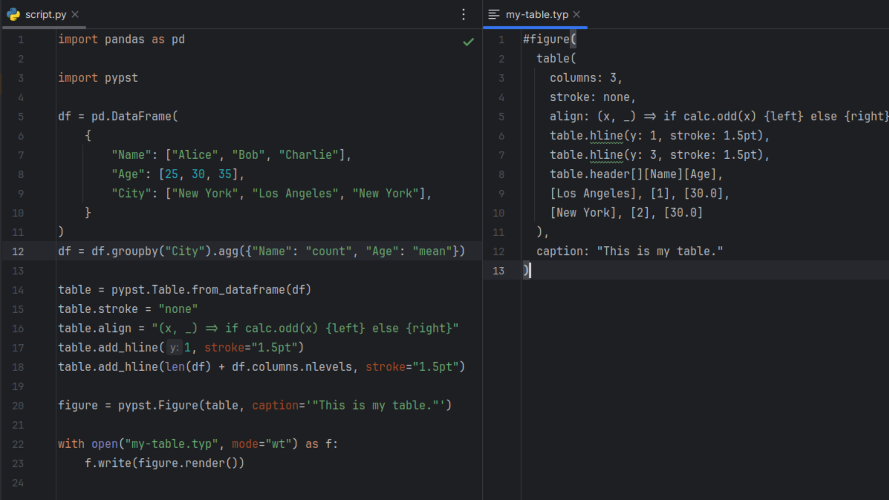

# Pypst

Declarative Typst in Python with Pandas data frame support.

Generate Typst tables from Pandas data frames and style them directly in Python.
Stop copy-pasting data from your analysis scripts to your Typst reports and
presentations.
Instead, generate them directly in Python with Pypst and use `#include("my-table.typ")`.
Columns and indexes with multiple levels are supported.

Pypst produces human-readable Typst code that you can modify and extend.



## Installation

Pypst is available on PyPI and can be installed via pip.

```bash
pip install pypst
```

## Usage

Create a data frame and do any data wrangling you need.

```python
import pandas as pd

df = pd.DataFrame({
    "Name": ["Alice", "Bob", "Charlie"],
    "Age": [25, 30, 35],
    "City": ["New York", "Los Angeles", "New York"]
})
df = df.groupby("City").agg({"Name": "count", "Age": "mean"})
```

Create a Typst table from the data frame and apply styling.
Then wrap it in a figure and save it to a file.

```python
import pypst

table = pypst.Table.from_dataframe(df)
table.stroke = "none"
table.align = "(x, _) => if calc.odd(x) {left} else {right}"
table.add_hline(1, stroke="1.5pt")
table.add_hline(len(df) + df.columns.nlevels, stroke="1.5pt")

figure = pypst.Figure(table, caption='"This is my table."')

with open("my-table.typ", mode="wt") as f:
    f.write(figure.render())
```

The resulting file looks like this:

```typst
#figure(
  table(
    columns: 3,
    stroke: none,
    align: (x, _) => if calc.odd(x) {left} else {right},
    table.hline(y: 1, stroke: 1.5pt),
    table.hline(y: 3, stroke: 1.5pt),
    table.header[][Name][Age],
    [Los Angeles], [1], [30.0],
    [New York], [2], [30.0]
  ),
  caption: "This is my table."
)
```

Include the file in your `main.typ` Typst document.

```typst
= My Section Heading

#lorem(100)

#include("my-table.typ")

#lorem(100)
```

Compile with `typst compile main.typ` to receive a PDF file like [this](examples/main.pdf).
By using `typst watch main.typ`, you can automatically recompile the when your Python script runs.


If your table uses third-party packages, you can wrap the figure in a document and include the proper imports.

```python
document = pypst.Document(figure)
document.add_import("@preview/unify:0.4.3", ["num"])
```

The resulting file looks like this:

```typst
#import "@preview/unify:0.4.3": num

#figure(
  table(
    columns: 3,
    stroke: none,
    align: (x, _) => if calc.odd(x) {left} else {right},
    table.hline(y: 1, stroke: 1.5pt),
    table.hline(y: 3, stroke: 1.5pt),
    table.header[][Name][Age],
    [Los Angeles], [1], [30.0],
    [New York], [2], [30.0]
  ),
  caption: "This is my table."
)
```

## Roadmap

If there is time and people are interested, I would like to add the following features:

- [ ] Complete table attributes (for example, `fill` is missing)
- [ ] Support automatic formating for common workflows, like automatically merging multi-level columns with mean and standard deviation
- [ ] Add more Typst elements (like headings, paragraphs, or lists) to make building more complex documents easier

## Contributing

Pull requests are welcome. For major changes, please open an issue first to discuss what you would like to change.
